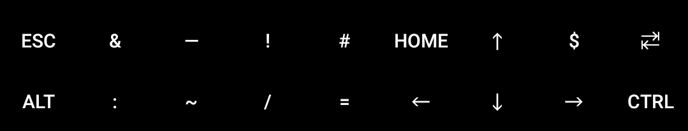
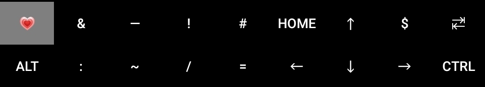
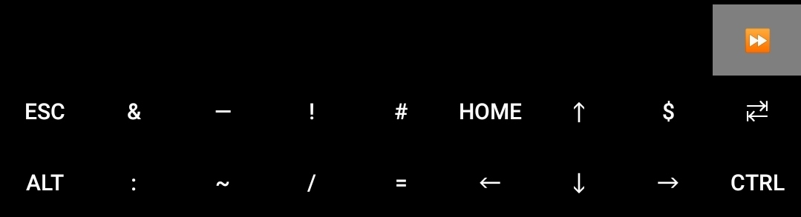
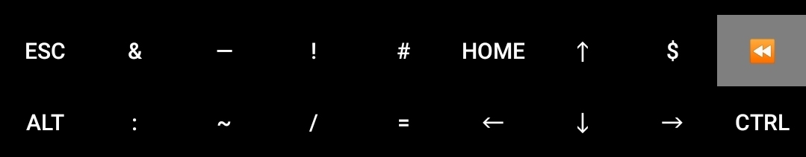
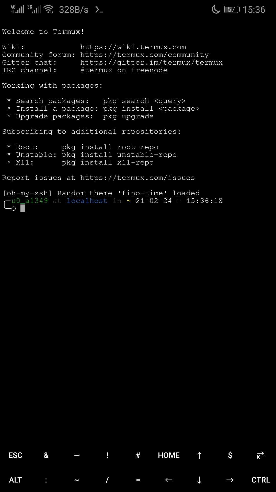
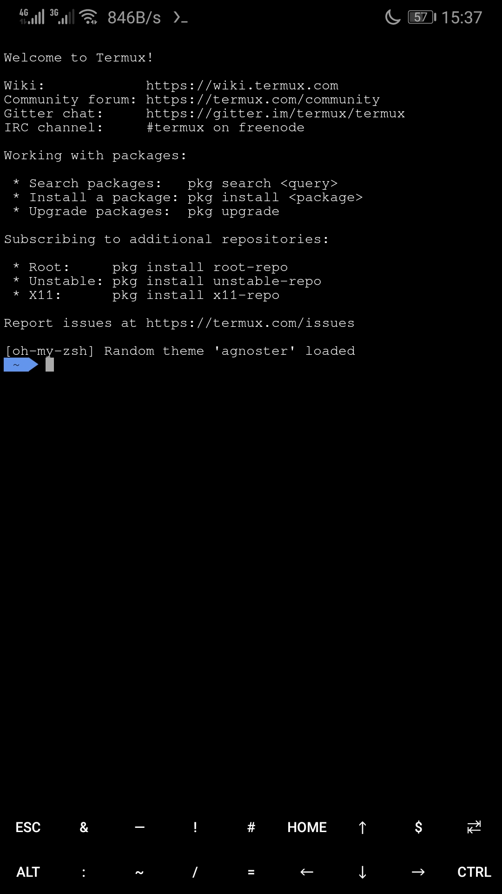
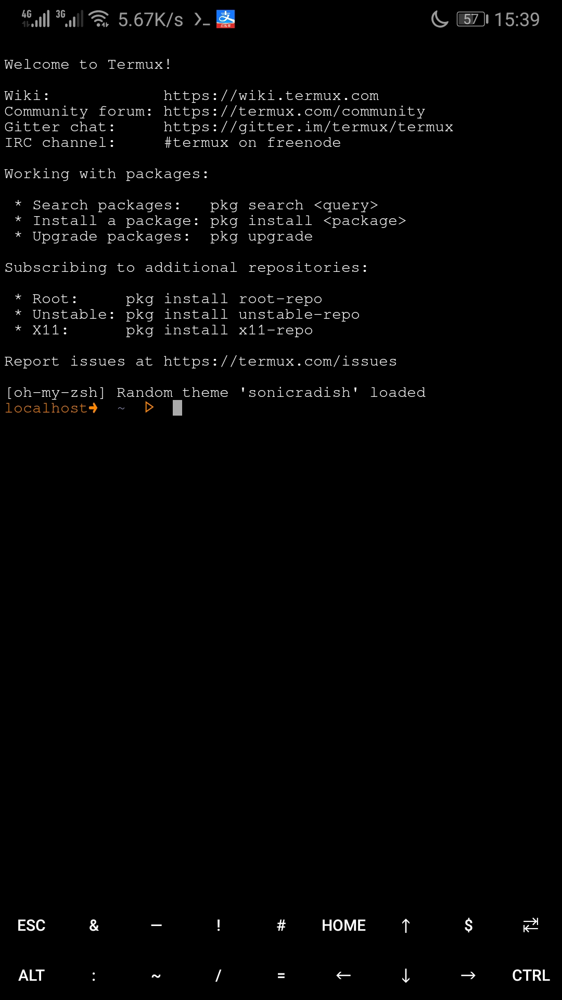

#### 介绍
由于一些原因，经常需要清空termux数据重新初始化，而手动配置又比较麻烦，所以将一些资源直接做成安装包，快速配置出(我)需要的termux环境
#### 使用效果展示
虚拟键盘扩展了上滑输入。

ALT上滑新建会话/TAB上滑切换到下个会话/CTRL上滑切换到上个会话








#### 安装说明

1.  添加apt源
    ```
    echo "deb [trusted=true] https://www.syomie.fun/termux-deb/ termux non-free" > ${PREFIX}/etc/apt/sources.list.d/syomie.list
    apt update
    ```
    关于该源见下方附加说明。
2.  安装oh-my-termux
    ```
    apt install oh-my-termux
    ```
#### 目录结构说明
* ./package          最终需要打包的目录
* ./package/data     软件包内容
* ./paxkage/DEBIAN   软件包控制信息目录


#### 关于syomie软件源
* 这是一个自用的软件源。
* 本源(包括软件包)目前没有任何签名/认证。
* 本源不提供任何保障，亦不承担任何使用该源造成的后果(责任)。
* 目前只在termux可用，并且不能替代官方源(并非镜像源，这里只有几个包，并且不打算在线上保留旧版本软件包，它的空间太小了)
* 包含部分来自网络，或从网络收集并由我重新打包的deb软件包，如果您发现错误/更新/侵权/上传其他包裹或其他问题，请提交问题反馈或<a href="mailto:lian1581@qq.com">发送邮件</a>联系。
* 待续……

#### 附: [syomie源软件包列表](./packagelist.md)
